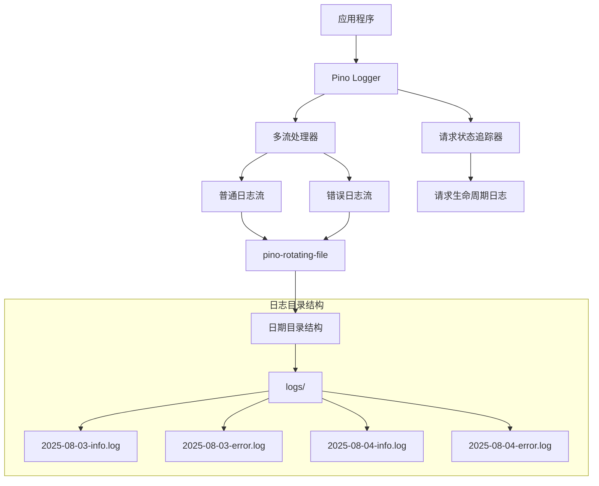
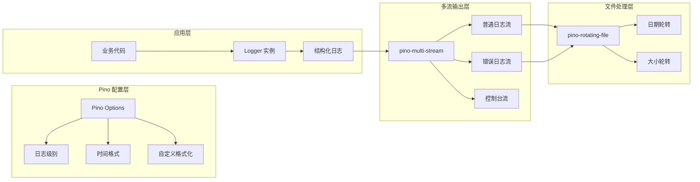

# 日志系统优化设计文档

## 1. 概述

本文档描述了 Claude Code Router 项目日志系统优化的技术设计方案。基于需求分析，本设计采用业界成熟的 Pino 日志库作为核心，解决当前日志系统存在的关键问题：单一日志文件过大、缺乏错误日志分离、无日志轮转机制，以及请求状态追踪不足等问题。

**设计原则**：
- 使用成熟的日志库（Pino）而非自行实现
- 充分利用 Pino 的高性能和扩展性
- 保持向后兼容性，确保平滑迁移
- 最小化性能影响，采用异步写入

## 2. 技术选型

### 2.1 核心日志库：Pino

**选择 Pino 的理由**：
- **高性能**：Pino 是 Node.js 生态中最快的日志库之一
- **结构化日志**：原生支持 JSON 格式，便于后续处理和分析
- **多流输出**：支持同时输出到多个目标（文件、控制台等）
- **丰富的插件生态**：支持多种传输、格式化器和旋转器
- **低开销**：对应用程序性能影响最小

### 2.2 相关依赖
```json
{
  "pino": "^9.7.0",
  "pino-roll": "^3.1.0",
  "pino-pretty": "^11.0.0"
}
```

**重要说明**：
- `pino-multi-stream` 已被弃用，Pino 9.x 内置了多流支持
- Pino 自带 TypeScript 类型定义，无需安装 `@types/pino`
- 使用 `pino-roll` 作为日志轮转方案（官方推荐）

## 3. 架构设计

### 3.1 整体架构



### 3.2 Pino 集成架构



## 4. 详细设计

### 4.1 Pino 基础配置

#### 4.1.1 核心配置（使用 Pino 9.x 内置多流支持）
```typescript
import pino, { Level, StreamEntry, DestinationStream } from 'pino';
import { join } from 'path';
import { existsSync, mkdirSync } from 'fs';

// Pino 日志级别枚举（与 Pino 内置级别一致）
const LOG_LEVELS = {
  trace: 10,
  debug: 20,
  info: 30,
  warn: 40,
  error: 50,
  fatal: 60
} as const;

type LogLevel = keyof typeof LOG_LEVELS;

interface LogConfig {
  level: LogLevel;
  enableFileRotation: boolean;
  retentionDays: number;
  logDirectory: string;
  enableBackwardCompatibility: boolean;
  maxFileSize?: string;
  rotationInterval?: string;
  compressLogs?: boolean;
  consoleOutput?: boolean;
  requestTracking: {
    enabled: boolean;
    includeDetails: boolean;
  };
}

// 创建日志目录 - 简化实现
const ensureLogDir = (dir: string): void => {
  if (!existsSync(dir)) {
    mkdirSync(dir, { recursive: true });
  }
};

const createPinoOptions = (config: LogConfig): pino.LoggerOptions => {
  return {
    level: config.level,
    // 基础字段会出现在每条日志中
    base: {
      pid: process.pid,
      hostname: require('os').hostname(),
      service: 'claude-code-router'
    },
    // 使用标准的 ISO 时间戳
    timestamp: pino.stdTimeFunctions.isoTime,
    // 自定义格式化器
    formatters: {
      // 级别格式化：将数字级别转换为字符串
      level: (level: number) => {
        return { level };
      },
      // 日志格式化：移除默认的 level 和 time 字段（避免重复）
      log: (object: any) => {
        const { level, time, ...rest } = object;
        return rest;
      }
    }
  };
};
```

#### 4.1.2 创建日志流配置（使用 Pino 9.x 内置多流支持）
```typescript
// 创建日志流配置 - 简化实现
const createLogStreams = (config: LogConfig): StreamEntry[] => {
  const streams: StreamEntry[] = [];
  
  if (config.enableFileRotation) {
    ensureLogDir(config.logDirectory);
    
    // 按级别分离的文件流 - 使用 Pino 9.x 内置的多流支持
    streams.push(
      { level: 'error', stream: pino.destination(join(config.logDirectory, 'error.log')) },
      { level: 'warn', stream: pino.destination(join(config.logDirectory, 'warn.log')) },
      { level: 'info', stream: pino.destination(join(config.logDirectory, 'info.log')) }
    );
  }
  
  if (config.consoleOutput) {
    streams.push({
      level: config.level,
      stream: process.stdout
    });
  }
  
  return streams;
};

// 创建带日期轮转的日志流 - 使用 pino-roll
const createRotatingStreams = async (config: LogConfig): Promise<StreamEntry[]> => {
  const streams: StreamEntry[] = [];
  
  if (config.enableFileRotation) {
    ensureLogDir(config.logDirectory);
    
    try {
      // 动态导入 pino-roll
      const pinoRoll = await import('pino-roll');
      
      // 创建按日期轮转的日志流
      streams.push(
        { 
          level: 'error', 
          stream: pinoRoll.default(join(config.logDirectory, 'error.log'), {
            frequency: 'daily',
            size: config.maxFileSize || '100M',
            compress: config.compressLogs || false
          })
        },
        { 
          level: 'warn', 
          stream: pinoRoll.default(join(config.logDirectory, 'warn.log'), {
            frequency: 'daily', 
            size: config.maxFileSize || '100M',
            compress: config.compressLogs || false
          })
        },
        { 
          level: 'info', 
          stream: pinoRoll.default(join(config.logDirectory, 'info.log'), {
            frequency: 'daily',
            size: config.maxFileSize || '100M', 
            compress: config.compressLogs || false
          })
        }
      );
    } catch (err) {
      // 如果 pino-roll 不可用，回退到普通文件流
      console.warn('pino-roll not available, using regular file streams:', err.message);
      return createLogStreams(config);
    }
  }
  
  if (config.consoleOutput) {
    streams.push({
      level: config.level,
      stream: process.stdout
    });
  }
  
  return streams;
};
```

### 4.2 增强的日志管理器（使用 Pino 9.x 最新特性）

#### 4.2.1 主日志管理器实现
```typescript
class EnhancedLogger {
  private pino: pino.Logger;
  private config: LogConfig;
  private requestTracker: RequestTracker;
  private compatibilityLayer?: CompatibilityLayer;

  constructor(config: LogConfig) {
    this.config = config;
    
    // 创建 Pino 配置 - 简化实现
    const pinoOptions = createPinoOptions(config);
    
    // 创建多流配置 - 使用 Pino 9.x 内置的 multistream
    const streams = createLogStreams(config);
    
    // 创建日志器实例
    this.pino = pino(
      pinoOptions,
      streams.length > 1 ? pino.multistream(streams) : streams[0]?.stream
    );
    
    this.requestTracker = new RequestTracker(this.pino);
    
    // 如果需要向后兼容，创建兼容层
    if (config.enableBackwardCompatibility) {
      this.compatibilityLayer = new CompatibilityLayer(this, config.logDirectory);
    }
  }
  
  // 基础日志方法 - 使用 Pino 原生方法
  trace(message: string, meta?: any): void {
    this.pino.trace(meta, message);
  }
  
  debug(message: string, meta?: any): void {
    this.pino.debug(meta, message);
  }
  
  info(message: string, meta?: any): void {
    this.pino.info(meta, message);
  }
  
  warn(message: string, meta?: any): void {
    this.pino.warn(meta, message);
  }
  
  error(message: string, meta?: any): void {
    this.pino.error(meta, message);
  }
  
  fatal(message: string, meta?: any): void {
    this.pino.fatal(meta, message);
  }
  
  // 创建子日志器（用于请求追踪）
  child(bindings: any): pino.Logger {
    return this.pino.child(bindings);
  }
  
  // 向后兼容日志方法
  log(...args: any[]): void {
    if (this.compatibilityLayer) {
      this.compatibilityLayer.log(...args);
    }
  }
  
  // 获取底层 Pino 实例
  getPino(): pino.Logger {
    return this.pino;
  }
}
```

#### 4.2.2 使用 pino-roll 的日志轮转实现
```typescript
// 创建带日志轮转的流配置 - 使用官方推荐的 pino-roll
const createRotatingLogStreams = async (config: LogConfig): Promise<StreamEntry[]> => {
  const streams: StreamEntry[] = [];
  
  if (config.enableFileRotation) {
    ensureLogDir(config.logDirectory);
    
    try {
      // 动态导入 pino-roll - 简化实现
      const pinoRoll = await import('pino-roll');
      
      // 按日志级别分离的轮转文件流
      streams.push(
        { 
          level: 'error', 
          stream: pinoRoll.default(join(config.logDirectory, 'error.log'), {
            frequency: 'daily',      // 每日轮转
            size: config.maxFileSize || '100M',  // 大小轮转
            compress: config.compressLogs || false,
            mkdir: true
          })
        },
        { 
          level: 'warn', 
          stream: pinoRoll.default(join(config.logDirectory, 'warn.log'), {
            frequency: 'daily',
            size: config.maxFileSize || '100M', 
            compress: config.compressLogs || false,
            mkdir: true
          })
        },
        { 
          level: 'info', 
          stream: pinoRoll.default(join(config.logDirectory, 'info.log'), {
            frequency: 'daily',
            size: config.maxFileSize || '100M',
            compress: config.compressLogs || false,
            mkdir: true
          })
        }
      );
    } catch (err) {
      // 如果 pino-roll 不可用，回退到 pino.destination
      console.warn('pino-roll not available, falling back to pino.destination:', err.message);
      return createLogStreams(config);
    }
  }
  
  // 控制台输出
  if (config.consoleOutput) {
    streams.push({
      level: config.level,
      stream: process.stdout
    });
  }
  
  return streams;
};
```

#### 4.2.3 性能优化的配置
```typescript
// 生产环境优化配置 - 简化实现
const createProductionConfig = (config: LogConfig): pino.LoggerOptions => {
  return {
    level: config.level,
    timestamp: pino.stdTimeFunctions.isoTime,
    // 禁用不必要的功能以提高性能
    prettyPrint: false,
    // 最小化元数据
    base: {
      pid: process.pid,
      hostname: require('os').hostname()
    },
    // 优化的格式化器
    formatters: {
      level: (label: string, number: number) => ({ 
        level: number 
      }),
      log: (object: any) => {
        const { level, time, ...rest } = object;
        return rest;
      }
    },
    // 使用 sonic-boom 进行高性能异步写入
    destination: pino.destination({
      dest: join(config.logDirectory, 'app.log'),
      sync: false,        // 异步写入
      minLength: 4096     // 缓冲区大小
    })
  };
};

// 开发环境配置（带美化输出）
const createDevelopmentConfig = (config: LogConfig): pino.LoggerOptions => {
  return {
    level: config.level,
    timestamp: pino.stdTimeFunctions.isoTime,
    base: {
      pid: process.pid,
      hostname: require('os').hostname()
    },
    // 开发环境使用 transport 进行美化输出
    transport: {
      target: 'pino-pretty',
      options: {
        colorize: true,
        translateTime: 'SYS:standard',
        ignore: 'pid,hostname'
      }
    }
  };
};
```
```

### 4.2 多流输出设计

#### 4.2.1 增强的日志管理器
```typescript
class EnhancedLogger {
  private pino: pino.Logger;
  private config: LogConfig;
  private streams: StreamEntry[];
  private requestTracker: RequestTracker;
  private compatibilityLayer?: CompatibilityLayer;
  
  constructor(config: LogConfig) {
    this.config = config;
    this.streams = createStreams(config);
    
    // 创建 Pino logger 实例
    const pinoOptions = createPinoOptions(config);
    this.pino = pino(pinoOptions, multistream(this.streams));
    
    // 初始化请求追踪器
    this.requestTracker = new RequestTracker(this.pino);
    
    // 如果启用向后兼容，创建兼容层
    if (config.enableBackwardCompatibility) {
      this.compatibilityLayer = new CompatibilityLayer(this, path.join(config.logDirectory, '..', 'claude-code-router.log'));
    }
  }
  
  // 基础日志方法
  trace(message: string, meta?: any): void {
    this.pino.trace(meta, message);
    this.writeToLegacy('trace', message, meta);
  }
  
  debug(message: string, meta?: any): void {
    this.pino.debug(meta, message);
    this.writeToLegacy('debug', message, meta);
  }
  
  info(message: string, meta?: any): void {
    this.pino.info(meta, message);
    this.writeToLegacy('info', message, meta);
  }
  
  warn(message: string, meta?: any): void {
    this.pino.warn(meta, message);
    this.writeToLegacy('warn', message, meta);
  }
  
  error(message: string, meta?: any): void {
    this.pino.error(meta, message);
    this.writeToLegacy('error', message, meta);
  }
  
  fatal(message: string, meta?: any): void {
    this.pino.fatal(meta, message);
    this.writeToLegacy('fatal', message, meta);
  }
  
  // 向后兼容写入
  private writeToLegacy(level: LogLevel, message: string, meta?: any): void {
    if (this.compatibilityLayer) {
      this.compatibilityLayer.write(level, message, meta);
    }
  }
  
  // 请求追踪方法
  startRequest(request: IncomingMessage): string {
    return this.requestTracker.startRequest(request);
  }
  
  updateStreamState(requestId: string, state: StreamState): void {
    this.requestTracker.updateStreamState(requestId, state);
  }
  
  endRequest(requestId: string, result: RequestResult): void {
    this.requestTracker.endRequest(requestId, result);
  }
  
  // 清理资源
  async shutdown(): Promise<void> {
    // 关闭所有文件流
    for (const stream of this.streams) {
      if (stream.stream !== process.stdout && typeof stream.stream.end === 'function') {
        stream.stream.end();
      }
    }
    
    if (this.compatibilityLayer) {
      await this.compatibilityLayer.shutdown();
    }
  }
}
```

#### 4.2.2 向后兼容层实现
```typescript
class CompatibilityLayer {
  private legacyLogPath: string;
  private legacyStream: fs.WriteStream;
  
  constructor(newLogger: EnhancedLogger, legacyLogPath: string) {
    this.legacyLogPath = legacyLogPath;
    
    // 确保目录存在
    const dir = path.dirname(legacyLogPath);
    if (!fs.existsSync(dir)) {
      fs.mkdirSync(dir, { recursive: true });
    }
    
    // 创建旧格式日志文件流
    this.legacyStream = fs.createWriteStream(legacyLogPath, { flags: 'a' });
  }
  
  write(level: LogLevel, message: string, meta?: any): void {
    try {
      const timestamp = new Date().toISOString();
      
      // 格式化元数据
      let metaStr = '';
      if (meta) {
        if (typeof meta === 'object') {
          metaStr = ' ' + JSON.stringify(meta);
        } else {
          metaStr = ' ' + String(meta);
        }
      }
      
      // 保持原有格式: [timestamp] message meta\n
      const logMessage = `[${timestamp}] ${message}${metaStr}\n`;
      
      // 异步写入，不阻塞主流程
      this.legacyStream.write(logMessage, 'utf8');
    } catch (err) {
      console.error('Failed to write to legacy log:', err);
    }
  }
  
  async shutdown(): Promise<void> {
    return new Promise((resolve) => {
      this.legacyStream.end(() => {
        resolve();
      });
    });
  }
}
```

### 4.3 日期轮转实现

#### 4.3.1 基于日期的文件名
```typescript
class DateBasedRotator {
  private basePath: string;
  private currentDate: string;
  currentStream: fs.WriteStream;
  
  constructor(basePath: string) {
    this.basePath = basePath;
    this.currentDate = this.getCurrentDate();
    this.currentStream = this.createStreamForDate(this.currentDate);
    
    // 每分钟检查一次日期变化
    setInterval(() => this.checkDateChange(), 60000);
  }
  
  private getCurrentDate(): string {
    return new Date().toISOString().split('T')[0]; // YYYY-MM-DD
  }
  
  private getFilePath(date: string): string {
    return path.join(this.basePath, `${date}.log`);
  }
  
  private createStreamForDate(date: string): fs.WriteStream {
    const filePath = this.getFilePath(date);
    const dir = path.dirname(filePath);
    
    if (!fs.existsSync(dir)) {
      fs.mkdirSync(dir, { recursive: true });
    }
    
    return fs.createWriteStream(filePath, { flags: 'a' });
  }
  
  private checkDateChange(): void {
    const newDate = this.getCurrentDate();
    if (newDate !== this.currentDate) {
      this.currentStream.end();
      this.currentStream = this.createStreamForDate(newDate);
      this.currentDate = newDate;
    }
  }
  
  write(data: string): void {
    this.currentStream.write(data);
  }
  
  end(): void {
    this.currentStream.end();
  }
}
```

#### 4.3.2 与 pino-rotating-file 集成
```typescript
const createRotatingStream = (type: 'info' | 'error', config: LogConfig) => {
  const dateRotator = new DateBasedRotator(config.logDirectory);
  
  return rotatingFile({
    path: path.join(config.logDirectory, `${type}.log`),
    size: config.maxFileSize || '100M',
    interval: '1d',
    mkdir: true,
    onRotate: (oldFile: string) => {
      // 清理过期文件
      cleanupOldFiles(config.logDirectory, config.retentionDays || 7);
    }
  });
};
```

### 4.4 请求状态追踪器

#### 4.4.1 基于 Pino 的请求追踪
```typescript
class RequestTracker {
  private logger: pino.Logger;
  private activeRequests: Map<string, RequestContext> = new Map();
  
  constructor(logger: pino.Logger) {
    this.logger = logger;
  }
  
  startRequest(request: IncomingMessage): string {
    const requestId = this.generateRequestId();
    const context: RequestContext = {
      id: requestId,
      startTime: new Date(),
      method: request.method,
      url: request.url,
      headers: request.headers,
      status: 'started'
    };
    
    this.activeRequests.set(requestId, context);
    
    this.logger.info({
      requestId,
      event: 'request_start',
      method: request.method,
      url: request.url,
      userAgent: request.headers['user-agent']
    }, 'Request started');
    
    return requestId;
  }
  
  updateStreamState(requestId: string, state: StreamState): void {
    const context = this.activeRequests.get(requestId);
    if (!context) return;
    
    const logData = {
      requestId,
      event: 'stream_state',
      state: state.type,
      finishReason: state.finishReason,
      timestamp: state.timestamp
    };
    
    if (state.type === 'chunk') {
      this.logger.debug(logData, 'Stream chunk received');
    } else if (state.type === 'end') {
      this.logger.info(logData, 'Stream ended normally');
      this.endRequest(requestId, 'completed', state.finishReason);
    } else if (state.type === 'error') {
      this.logger.error(logData, 'Stream error occurred');
      this.endRequest(requestId, 'failed', state.finishReason, state.error);
    }
  }
  
  private endRequest(requestId: string, status: 'completed' | 'failed', finishReason?: string | null, error?: Error): void {
    const context = this.activeRequests.get(requestId);
    if (!context) return;
    
    const endTime = new Date();
    const duration = endTime.getTime() - context.startTime.getTime();
    
    const logData = {
      requestId,
      event: 'request_end',
      status,
      duration,
      finishReason,
      method: context.method,
      url: context.url
    };
    
    if (error) {
      logData.error = {
        message: error.message,
        stack: error.stack,
        name: error.name
      };
    }
    
    if (status === 'completed') {
      this.logger.info(logData, 'Request completed successfully');
    } else {
      this.logger.error(logData, 'Request failed');
    }
    
    this.activeRequests.delete(requestId);
  }
  
  private generateRequestId(): string {
    return `req_${Date.now()}_${Math.random().toString(36).substr(2, 9)}`;
  }
}
```

### 4.5 向后兼容处理

#### 4.5.1 兼容层实现
```typescript
class CompatibilityLayer {
  private newLogger: EnhancedLogger;
  private legacyLogPath: string;
  
  constructor(newLogger: EnhancedLogger, legacyLogPath: string) {
    this.newLogger = newLogger;
    this.legacyLogPath = legacyLogPath;
  }
  
  log(...args: any[]): void {
    // 保持原有格式写入旧文件
    this.writeToLegacyFile(args);
    
    // 同时写入新系统
    const message = this.formatMessage(args);
    const level = this.inferLevel(args);
    this.newLogger[level](message);
  }
  
  private writeToLegacyFile(args: any[]): void {
    const timestamp = new Date().toISOString();
    const message = args
      .map(arg => typeof arg === 'object' ? JSON.stringify(arg) : String(arg))
      .join(' ');
    const logMessage = `[${timestamp}] ${message}\n`;
    
    fs.appendFile(this.legacyLogPath, logMessage, 'utf8').catch(err => {
      console.error('Failed to write to legacy log:', err);
    });
  }
  
  private formatMessage(args: any[]): string {
    return args
      .map(arg => typeof arg === 'object' ? JSON.stringify(arg) : String(arg))
      .join(' ');
  }
  
  private inferLevel(args: any[]): keyof EnhancedLogger {
    const message = args.join(' ').toLowerCase();
    
    if (message.includes('error') || message.includes('failed')) {
      return 'error';
    } else if (message.includes('warning') || message.includes('warn')) {
      return 'warn';
    } else {
      return 'info';
    }
  }
}
```

### 4.6 配置集成

#### 4.6.1 扩展现有配置
```typescript
interface LogConfig {
  level: string;
  enableFileRotation: boolean;
  retentionDays: number;
  logDirectory: string;
  enableBackwardCompatibility: boolean;
  maxFileSize?: string;
  rotationInterval?: string;
  compressLogs?: boolean;
  consoleOutput?: boolean;
  requestTracking: {
    enabled: boolean;
    includeDetails: boolean;
  };
}

// 从现有配置文件读取日志配置
const loadLogConfig = (existingConfig: any): LogConfig => {
  return {
    level: existingConfig.Logging?.level || 'info',
    enableFileRotation: existingConfig.Logging?.enableFileRotation ?? true,
    retentionDays: existingConfig.Logging?.retentionDays || 7,
    logDirectory: existingConfig.Logging?.logDirectory || path.join(os.homedir(), '.claude-code-router', 'logs'),
    enableBackwardCompatibility: existingConfig.Logging?.enableBackwardCompatibility ?? true,
    maxFileSize: existingConfig.Logging?.maxFileSize || '100M',
    rotationInterval: existingConfig.Logging?.rotationInterval || '1d',
    compressLogs: existingConfig.Logging?.compressLogs || false,
    consoleOutput: existingConfig.Logging?.consoleOutput ?? false,
    requestTracking: {
      enabled: existingConfig.Logging?.requestTracking?.enabled ?? true,
      includeDetails: existingConfig.Logging?.requestTracking?.includeDetails ?? true
    }
  };
};
```

### 4.7 性能优化

#### 4.7.1 Pino 性能优化配置
```typescript
const createOptimizedLogger = (config: LogConfig): pino.Logger => {
  return pino({
    level: config.level,
    // 使用自定义时间戳格式，提高性能
    timestamp: () => `,"time":"${new Date().toISOString()}"`,
    // 禁用不必要的功能
    prettyPrint: false,
    enabled: true,
    // 自定义级别格式化，减少字符串操作
    customLevels: {
      trace: 10,
      debug: 20,
      info: 30,
      warn: 40,
      error: 50,
      fatal: 60
    },
    // 使用最简洁的键名，减少日志体积
    formatters: {
      level: (label: string, number: number) => {
        return { level: number };
      },
      bindings: (bindings: any) => {
        return { pid: bindings.pid, host: bindings.hostname };
      }
    }
  });
};
```

#### 4.7.2 批量写入优化
```typescript
class BatchWriter {
  private buffer: string[] = [];
  private timer: NodeJS.Timeout | null = null;
  private stream: fs.WriteStream;
  private flushInterval: number;
  private batchSize: number;
  
  constructor(stream: fs.WriteStream, flushInterval: number = 1000, batchSize: number = 100) {
    this.stream = stream;
    this.flushInterval = flushInterval;
    this.batchSize = batchSize;
  }
  
  write(data: string): void {
    this.buffer.push(data);
    
    if (this.buffer.length >= this.batchSize) {
      this.flush();
    } else if (!this.timer) {
      this.timer = setTimeout(() => this.flush(), this.flushInterval);
    }
  }
  
  private flush(): void {
    if (this.buffer.length === 0) return;
    
    const batch = this.buffer.join('');
    this.stream.write(batch);
    this.buffer = [];
    
    if (this.timer) {
      clearTimeout(this.timer);
      this.timer = null;
    }
  }
  
  end(): void {
    this.flush();
    this.stream.end();
  }
}
```

## 5. 测试策略

### 5.1 单元测试
- **Pino 集成测试**：验证 Pino 配置、多流输出、日志格式
- **请求追踪器测试**：验证请求生命周期追踪准确性
- **日志轮转测试**：验证文件轮转和清理逻辑
- **兼容层测试**：验证向后兼容的正确性

### 5.2 集成测试
- **端到端日志测试**：验证从日志生成到文件写入的完整流程
- **流式响应追踪测试**：验证流式状态的准确记录
- **性能测试**：验证高并发情况下的性能表现

### 5.3 压力测试
- **并发写入测试**：模拟高并发日志写入场景
- **大文件处理测试**：测试大日志文件的处理性能
- **长时间运行测试**：验证系统的稳定性和内存泄漏

## 6. 部署和配置

### 6.1 配置文件扩展
在现有 `config.json` 中添加日志配置：

```json
{
  "Logging": {
    "level": "info",
    "enableFileRotation": true,
    "retentionDays": 7,
    "logDirectory": "~/.claude-code-router/logs",
    "enableBackwardCompatibility": true,
    "maxFileSize": "100M",
    "rotationInterval": "1d",
    "compressLogs": false,
    "consoleOutput": false,
    "requestTracking": {
      "enabled": true,
      "includeDetails": true
    }
  }
}
```

### 6.2 迁移策略
1. **第一阶段**：部署新日志系统，启用向后兼容模式
2. **第二阶段**：监控新系统运行状况，收集反馈
3. **第三阶段**：逐步禁用旧日志系统，完全切换到新系统
4. **第四阶段**：清理向后兼容代码，完成迁移

### 6.3 依赖管理
```bash
# 安装核心依赖（基于 Pino 9.x 官方推荐）
npm install pino@^9.7.0 pino-roll@^3.1.0 pino-pretty@^11.0.0

# 可选依赖（根据需要选择）
npm install pino-http@^9.0.0    # HTTP 应用集成
npm install pino-socket@^5.0.0  # 网络传输
npm install pino-syslog@^5.0.0  # 系统日志集成

# 开发依赖（Pino 自带 TypeScript 类型定义，无需额外安装）
npm install --save-dev @types/node  # 如果需要 Node.js 类型定义
```

**重要说明**：
- **无需安装 `@types/pino`**：Pino 9.x 自带完整的 TypeScript 类型定义
- **无需安装 `pino-multi-stream`**：已被弃用，Pino 9.x 内置多流支持
- **无需安装 `pino-rotating-file`**：推荐使用官方的 `pino-roll`
- **性能优势**：Pino 使用 `sonic-boom` 进行高性能异步写入，默认启用

## 7. 监控和告警

### 7.1 日志系统监控
- **磁盘使用率**：监控日志目录磁盘使用情况
- **写入性能**：监控日志写入延迟和吞吐量
- **错误率**：监控错误日志生成频率

### 7.2 告警机制
- **磁盘空间不足**：当日志目录使用率超过80%时告警
- **日志写入失败**：当日志写入失败次数超过阈值时告警
- **异常请求增多**：当异常中断请求数量突增时告警

## 8. 风险评估和应对措施

### 8.1 技术风险
- **Pino 依赖风险**：依赖第三方库可能存在兼容性问题
  - **应对**：固定版本号，充分测试，考虑备用方案

- **性能影响**：新日志系统可能影响应用性能
  - **应对**：采用异步写入和缓冲机制，进行充分性能测试
  
- **数据丢失**：日志写入过程中可能发生数据丢失
  - **应对**：实现写入确认机制，关键日志同步写入

- **迁移风险**：从旧系统迁移可能影响现有功能
  - **应对**：采用渐进式迁移，保持向后兼容

### 8.2 运维风险
- **磁盘空间**：日志轮转失败可能导致磁盘空间不足
  - **应对**：实现多重监控和告警机制

- **配置错误**：错误配置可能导致日志系统异常
  - **应对**：实现配置验证机制，提供默认配置

## 9. 性能基准和优化

### 9.1 Pino 性能特性
- **零开销字符串格式化**：Pino 在生产环境中不进行字符串格式化
- **异步写入**：所有日志操作都是异步的，不阻塞主线程
- **最小内存占用**：Pino 设计为内存效率最高

### 9.2 优化策略
- **批量写入**：使用 `pino-extreme` 进行批量写入优化
- **日志级别过滤**：在运行时过滤日志级别，减少不必要的处理
- **压缩传输**：启用日志压缩减少磁盘占用

## 10. 实施计划

### 10.1 开发阶段
1. **环境准备**：安装 Pino 相关依赖，配置开发环境
2. **核心模块开发**：实现日志管理器、多流输出、请求追踪
3. **兼容层开发**：实现向后兼容层
4. **单元测试**：对各模块进行充分的单元测试

### 10.2 集成阶段
1. **系统集成**：将新日志系统集成到现有代码中
2. **集成测试**：进行端到端的功能测试
3. **性能测试**：进行性能基准测试
4. **问题修复**：修复测试中发现的问题

### 10.3 部署阶段
1. **灰度发布**：先在测试环境部署，然后逐步推广到生产环境
2. **监控验证**：密切监控新系统的运行状况
3. **用户培训**：提供相关文档和培训
4. **全面切换**：在确认系统稳定后，完成全面切换

本设计基于成熟的 Pino 日志库，充分利用了其高性能和丰富的生态系统，同时保持了向后兼容性。相比自行实现，这种方式更加可靠、高效，且更易于维护。